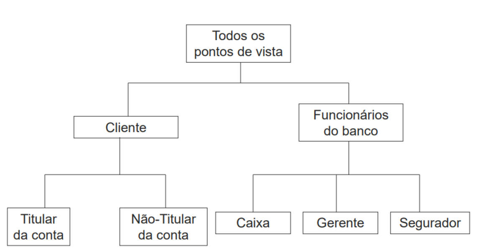
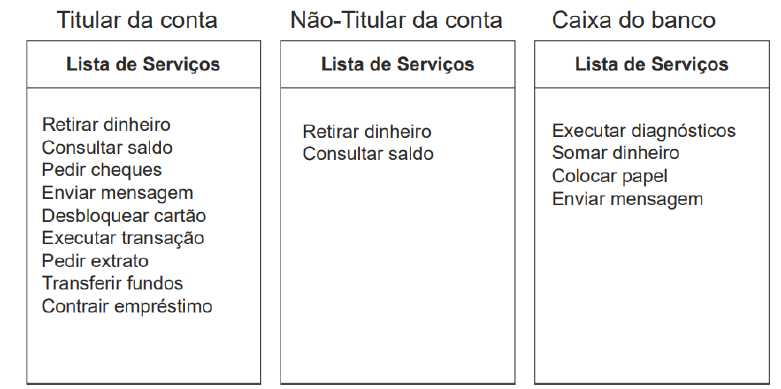
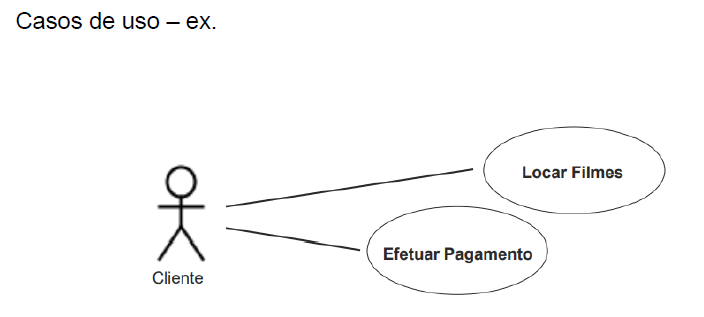

## Gestão de Requisitos de Software

## Aula 01
* Requisitos de software, definição, classificação e elicitação
* Definição
    * Os requisitos expressam as necessidades dos usuários e as restrições que devem ser consideradas durante o desenvolvimento.
    * Qualquer coisa que precisa ser concebida.
    * Uma condição ou uma capacidade de que alguém necessita para resolver um problema ou atingir um objetivo
    * Uma propriedade que um software deve ter para resolver um problema do mundo real.
* Importância
    * Os requisitos de software são determinantes críticos da qualidade de software
    * Os requisitos de software são a fundação a partir da qual a qualidade é medida. A falta de conformidade com os requisitos é a falta de qualidadee.
    * Para que um software seja considerado de qualidade é necessário que esteja em conformidade com os seus requisitos, atenda às expectativas do cliente e seja bem aceito por seus usuários.
* Classificação
    * **Requisitos funcionais**: descreve uma funcionalidade q disponibilizar aos usuários de um sistema, caracterizando o comprotamento deste como resposta aos estímulos a que está sujeito.
    * **Requisitos não funcionais**: corresponde a um conjunto de restrições impostas a ser desenvolvido, estabelecendo, por ex., quão atrativo, usável, rápido ou confiável é o sistema.
    * Podem ser classificados ainda, seja funcional ou não funcional como:
        * **Requisitos primários**: provém diretamente de alguma parte interessada, ou seja, foi solicitado opr uma pessoa ou entidade
        * **Requisitos secundários**: são obtidos por refinamento de um requisito primário.    
    * Requisitos não funcionais podem ser divididos em:
        * **Requisitos de produto**: caracterizam aspectos do funcionamento do produto, ex., confiabilidade, desempenho, eficiência, portabilidade, usabilidade, testabilidade, manutenibilidade.
        * **Requisitos organizacionais**: provém de estratégias e procedimento estabelecidos no contexto do fabricante do produto ou da organização do cliente, ex., normas a serem seguidas, requisitos de implementação, como a linguagem de programação a usar.
        * **Requisitos externos**: tem origem em fatores externos ao produto ou ao desenvolvimento, ex., requisitos de interoperabilidade que definem como os produtos interagem com outros sistemas, requisitos legais, requisitos éticos.
    * Tipos de requisitos não funcionais:
        * Aparência
        * Usabilidade
        * Desempenho
        * Operacional
        * Manutenção e suporte
        * Segurança
        * Cultura organizacional
        * Legal
    * **Requisitos não funcionais**:
        * Aparência:
            * O produto deve ter um estilo igual ao dos outros produtos da empresa.
            * O produto deve ser atrativo para usuários adolescentes.
            * O produto deve ser identificável com a empresa onde será usado.
        * Usabilidade:
            * O produto deve limpar o campo e exibir mensagem de erro quando o usuário entrar com dados incorretos. (facilidade de uso)
            * O produto deve ser especialmente intuitivo de usar para crianças com 4 anos de idade. (facilidade de aprendizagem)
            * O produto deve ser apresentado ao usuário na língua portuguesa e inglesa. (personalização)
        * Desempenho
            * O produto deve identificar o funcionário com base na foto em menos de 3 segundos. (tempo de resposta)
            * o produto deve trabalhar em modo local, se perder a conexão com o servidor. (disponibilidade)
            * O produto deve calcular os juros até os décimos de centavos. ( precisão dos resultados)
            * $Disponibilidade = \frac{tempo médio entre falhas}{tempo médio entre falhas + tempo médio de reparação}$
        * Operacional:
            * O produto deve operar debaixo de água até a profundidade de 30 metros.
            * O produto deve carregar os dados em lote por meio de arquivos texto.
            * O produto deve exportar o curriculum vitae no formato PDF.
        * Manutenção e suporte:
            * O programa do produto deve conter comentários.
            * O produto deve estar preparado para ser utilizado em qualquer língua.
            * O produto deve estar preparado para ser utilizado em qualquer língua.
            * O produto deve disponibilizar um tutorial que explique como operá-lo.
        * Segurança:
            * Os dados de avaliação de desempenho de um funcionário devem ser fornecidos apenas ao próprio funcionário e aos seus superiores.
            * O produto deve garantir que só usuários registrados tenham acesso aos dados clínicos dos pacientes.
            * O produto deve solicitar senha de acesso com no mínimo 8 dígitos, que contenha letras, números e caracteres especiais.
        * Cultural e organizacional
            * O produto deve usar português do Brasil.
            * O produto deve mostrar os feriados locais no calendário.
            * O produto deve usr componentes fabricados no Mercosul.
        * Legal
            * O produto deve estar alinhado ao referencial de gestão do pmbok.
            * O produto deve ser certificado pela autoridade tributária e aduaneira
            * O produto deve atender às normas estabelecidas na Lei nº 8112/90.
* Requisitos de usuário x requisitos de sistema
    * Requisitos de usuário
        * O usuário manipula arquivo criados por outros usuários.
    * Requisitos de sistema
        1. Os tipos de arquivo e os respectivos são definidos pelo usuário.
        2. Cada tipo de arquivo é representado por um ícone distinto.
        3. Cata tipo de arquivo está associado a um programa que processa e manipula os correspondentes arquivos.
        4. Quando um usuário clica em um ícone de um arquivo, esse arquivo é automaticamente aberto pelo programa que está associado a ele.
* Elicitação de requisitos
    * As necessidades dos clientes, o domínio e restrições do negócio devem ser detectados, com o objetivo de fornecer o mais correto entendimento do que é esperado do sistema de software a ser produzido.
* Técnicas de elicitação de requisitos
    * Descoberta de requisitos (ponto de vista)
    * Entrevistas
    * Cenários
    * Casos de uso
    * Etnografia

* Pontos de vista:
    * 
    * 

* Entrevistas
    * Entrevistas fechadas: conjunto pré-definido de perguntas
    * Entrevistas abertas: sem agenda pré-definida; se adapta para explorar o conhecimento do stakeholder.
* Cenários
    * Nome do cenário: sacar dinheiro
    * Ator: correntista
    * Pré-condição: conta e senha valida
    * Fluxo normal:
        1. Entrar com valor do saque
        2. Confirmar dados e operação
        3. Debitar valor da conta do cliente
    * Fluxo alternativo: 
        1. Saldo insuficiente
        2. Apresentar aviso ao cliente
    * Pós-condição: Valor sacado é debitado do saldo do cliente
* Casos de uso
    * 
* Etnografia
    * Para descobrir como as pessoas realmente trabalham
    * Para descobrir a cooperação e conscientização das atividades de outras pessoas
    * Para desenvolver um protótipo
    * Para descobrir importantes detalhes que outros métodos omitem.
    

    
