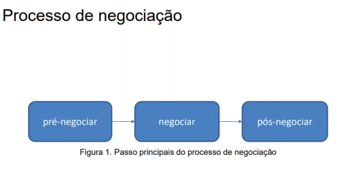

## Gestão de Requisitos de Software

## Aula 01
* Requisitos de software, definição, classificação e elicitação
* Definição
    * Os requisitos expressam as necessidades dos usuários e as restrições que devem ser consideradas durante o desenvolvimento.
    * Qualquer coisa que precisa ser concebida.
    * Uma condição ou uma capacidade de que alguém necessita para resolver um problema ou atingir um objetivo
    * Uma propriedade que um software deve ter para resolver um problema do mundo real.
* Importância
    * Os requisitos de software são determinantes críticos da qualidade de software
    * Os requisitos de software são a fundação a partir da qual a qualidade é medida. A falta de conformidade com os requisitos é a falta de qualidadee.
    * Para que um software seja considerado de qualidade é necessário que esteja em conformidade com os seus requisitos, atenda às expectativas do cliente e seja bem aceito por seus usuários.
* Classificação
    * **Requisitos funcionais**: descreve uma funcionalidade q disponibilizar aos usuários de um sistema, caracterizando o comprotamento deste como resposta aos estímulos a que está sujeito.
    * **Requisitos não funcionais**: corresponde a um conjunto de restrições impostas a ser desenvolvido, estabelecendo, por ex., quão atrativo, usável, rápido ou confiável é o sistema.
    * Podem ser classificados ainda, seja funcional ou não funcional como:
        * **Requisitos primários**: provém diretamente de alguma parte interessada, ou seja, foi solicitado opr uma pessoa ou entidade
        * **Requisitos secundários**: são obtidos por refinamento de um requisito primário.    
    * Requisitos não funcionais podem ser divididos em:
        * **Requisitos de produto**: caracterizam aspectos do funcionamento do produto, ex., confiabilidade, desempenho, eficiência, portabilidade, usabilidade, testabilidade, manutenibilidade.
        * **Requisitos organizacionais**: provém de estratégias e procedimento estabelecidos no contexto do fabricante do produto ou da organização do cliente, ex., normas a serem seguidas, requisitos de implementação, como a linguagem de programação a usar.
        * **Requisitos externos**: tem origem em fatores externos ao produto ou ao desenvolvimento, ex., requisitos de interoperabilidade que definem como os produtos interagem com outros sistemas, requisitos legais, requisitos éticos.
    * Tipos de requisitos não funcionais:
        * Aparência
        * Usabilidade
        * Desempenho
        * Operacional
        * Manutenção e suporte
        * Segurança
        * Cultura organizacional
        * Legal
    * **Requisitos não funcionais**:
        * Aparência:
            * O produto deve ter um estilo igual ao dos outros produtos da empresa.
            * O produto deve ser atrativo para usuários adolescentes.
            * O produto deve ser identificável com a empresa onde será usado.
        * Usabilidade:
            * O produto deve limpar o campo e exibir mensagem de erro quando o usuário entrar com dados incorretos. (facilidade de uso)
            * O produto deve ser especialmente intuitivo de usar para crianças com 4 anos de idade. (facilidade de aprendizagem)
            * O produto deve ser apresentado ao usuário na língua portuguesa e inglesa. (personalização)
        * Desempenho
            * O produto deve identificar o funcionário com base na foto em menos de 3 segundos. (tempo de resposta)
            * o produto deve trabalhar em modo local, se perder a conexão com o servidor. (disponibilidade)
            * O produto deve calcular os juros até os décimos de centavos. ( precisão dos resultados)
            * $Disponibilidade = \frac{tempo médio entre falhas}{tempo médio entre falhas + tempo médio de reparação}$
        * Operacional:
            * O produto deve operar debaixo de água até a profundidade de 30 metros.
            * O produto deve carregar os dados em lote por meio de arquivos texto.
            * O produto deve exportar o curriculum vitae no formato PDF.
        * Manutenção e suporte:
            * O programa do produto deve conter comentários.
            * O produto deve estar preparado para ser utilizado em qualquer língua.
            * O produto deve estar preparado para ser utilizado em qualquer língua.
            * O produto deve disponibilizar um tutorial que explique como operá-lo.
        * Segurança:
            * Os dados de avaliação de desempenho de um funcionário devem ser fornecidos apenas ao próprio funcionário e aos seus superiores.
            * O produto deve garantir que só usuários registrados tenham acesso aos dados clínicos dos pacientes.
            * O produto deve solicitar senha de acesso com no mínimo 8 dígitos, que contenha letras, números e caracteres especiais.
        * Cultural e organizacional
            * O produto deve usar português do Brasil.
            * O produto deve mostrar os feriados locais no calendário.
            * O produto deve usr componentes fabricados no Mercosul.
        * Legal
            * O produto deve estar alinhado ao referencial de gestão do pmbok.
            * O produto deve ser certificado pela autoridade tributária e aduaneira
            * O produto deve atender às normas estabelecidas na Lei nº 8112/90.
* Requisitos de usuário x requisitos de sistema
    * Requisitos de usuário
        * O usuário manipula arquivo criados por outros usuários.
    * Requisitos de sistema
        1. Os tipos de arquivo e os respectivos são definidos pelo usuário.
        2. Cada tipo de arquivo é representado por um ícone distinto.
        3. Cata tipo de arquivo está associado a um programa que processa e manipula os correspondentes arquivos.
        4. Quando um usuário clica em um ícone de um arquivo, esse arquivo é automaticamente aberto pelo programa que está associado a ele.
* Elicitação de requisitos
    * As necessidades dos clientes, o domínio e restrições do negócio devem ser detectados, com o objetivo de fornecer o mais correto entendimento do que é esperado do sistema de software a ser produzido.
* Técnicas de elicitação de requisitos
    * Descoberta de requisitos (ponto de vista)
    * Entrevistas
    * Cenários
    * Casos de uso
    * Etnografia

* Pontos de vista:
    * 
    * 

* Entrevistas
    * Entrevistas fechadas: conjunto pré-definido de perguntas
    * Entrevistas abertas: sem agenda pré-definida; se adapta para explorar o conhecimento do stakeholder.
* Cenários
    * Nome do cenário: sacar dinheiro
    * Ator: correntista
    * Pré-condição: conta e senha valida
    * Fluxo normal:
        1. Entrar com valor do saque
        2. Confirmar dados e operação
        3. Debitar valor da conta do cliente
    * Fluxo alternativo: 
        1. Saldo insuficiente
        2. Apresentar aviso ao cliente
    * Pós-condição: Valor sacado é debitado do saldo do cliente
* Casos de uso
    * 
* Etnografia
    * Para descobrir como as pessoas realmente trabalham
    * Para descobrir a cooperação e conscientização das atividades de outras pessoas
    * Para desenvolver um protótipo
    * Para descobrir importantes detalhes que outros métodos omitem.
    
* Engenharia de requisitos
    * Importância
        * vislumbra a qualidade do produto final por meio do alcance da qualidade nas etapas intermediárias do processo de desenvolvimento.
        * permite o desenvolvimento de sistemas de software que satisfaçam a todos os stakeholders
    * Abrangência
        * a engenharia de requisitos preocupa-se com a descoberta, o desenvolvimento, o rastreamento, a análise, o teste, a comunicação e a gestão de requisitos com o objetivo de definir o sistema em diferentes níveis de abstração.
            1. Todos os requisitos relevantes são explicitamente conhecidos e compreendidos com o necessário nível de detalhe.
            2. É alcançado entre as partes interessadas, um acordo em relação aos requisitos.
            3. Todos os requisitos estão devidamente documentados, em conformidade com os formatos e as regras estabelecidos.
    * Fases
        * Abrange aspectos de elaboração, documentação e manutenção dos requisitos durante todo o ciclo de vida de desenvolvimento de software.
        * 
* Gestão de requisitos
    * O que é: processo que estabelece e mantém acordos entre o cliente e a equipe do projeto sobre a evolução dos requisitos.
    * Objetivo: monitorar o desenvolvimento e implementação dos requisitos, registrando seus atributos, status e dependências para controlar o andamento e as mudanças realizadas e manter a rastreabilidade.
    * A gestão envolve ainda a priorização de requisitos que normalmente ocorre na fase de análise de requisitos.
    * Atividades principais:
        *  
    * Atributos de requisitos
        * São dados recolhidos ao longo do processo de análise de requisitos, desde a especificação até a aprovação da especificação final ou posteriores mudanças até a implementação dos requisitos.
        *  
    * Tipos de atributos
        *  
        * 
        * 
        * 
        * 

## Aula 03        
### Negociação e priorização de requisitos

* Análise e negociação de requisitos
    * A negociação é um processo social básico que tem como objetivo a resolução de conflitos
    * Objetivo:
        * Estabelecer uma aceitação sobre um conjunto de requisitos completos e consistente4s onde devem ser resolvidas quaisquer ambiguidades.
        * Durante este processo são descobertos requisitos que faltam, conflitos entre requisitos ( o que exige que se tomem decisões atendendo aos benefícios face aos custos), ambiguidade, sobreposições, requisitos irrealistas, etc.
* Exemplo
    * Uma parte interessada pede: quero que a aplicação seja reiniciada, no caso de uma falha ser detectada
    * Enquanto outra parte interessada pede: quero que a aplicação continua a funcionar, caso ocorra uma falha.
    * 
* Processo de negociação
    * pré negociação
        * Definir o problema.
        * Identificar as partes interessadas.
        * Levantar os objetivos das partes interessadas e analisar os possíveis conflitos.
        * Apresentar alternativas para cada conflito identificado.
    * negociação
        * procurar soluções mutuamente benéficas que sejam aceitáveis para todas as partes
        * Estabelecer critérios de avaliação para comparar o mérito das diferentes alternativas
        * chegar a um acordo entre as partes interessadas.
    * pós-negociação
        * analisar e avaliar o resultado da negociação
        * sugerir renegociação, se necessário
        * encontrar uma alternativa que aumente a satisfação de uma das partes sem baixar a das outras
        * obter a aprovação das partes interessadas.

* Negociação
    * Uma negociação pode ser resolvida de duas vias
        * Consenso ou unanimidade
        * Maioria
        * 
    * Ganho-perda
        * 
    * Estratégias
        * 
        
* Priorização de requisitos
    * Prioridade é o direito relativo que um requisito tem de utilizar recursos (tempo, esforço humano, recursos financeiros, espaço ...) limitados ou escassos
    * Os requisitos geralmente são implementados em etapas e a priorização ajuda a definir quais devem ser implementados primeiro
    * Identifica e ordena requisitos fundamentais, segundo um ou vários critérios de priorização.
    * É um processo contínuo que pode mudar ao longo do desenvolvimento do projeto
    * Dificuldades
        * desejo de classificar tudo com alta prioridade
        * clientes não reconhecem a necessidade de se fazer escolhas
        * partes interessadas evitam escolhas difíceis
        * priorização ser influenciada intenciona ou não pela equipe de desenvolvimento que pode superestimar a dificuldade ou complexidade de implementação de certos requisitos.
    * Etapas
        * Preparação: etapa na qual uma pessoa estrutura os requisitos de acordo com o método de priorização utilizado. Uma equipe é escolhida e recebe as informações necessárias
        * Execução: nesta etapa os decisores realizam a priorização utilizando para isso as informações concebidas na etapa anterior
        * Apresentação: consiste na apresentação dos resultados aos envolvidos. Alguns métodos de priorização utilizam diferentes formas para os cálculos das prioridades, mas estes devem ser realizados antes da apresentação dos resultados.
    * Tarefas
        * Decidir sobre os requisitos fundamentais para o sistema
        * Estabelecer uma ordem para a implementação dos requisitos
        * Implementar apenas uma parte dos requisitos e conseguir, ainda assim, um produto que satisfaça os usuários
        * comparar o benefício de cada requisito com o custo
        * estimar a satisfação do cliente em relação ao produto
        * tratar requisitos contraditórios e negociá-los com as partes interessadas.
    * Critérios
        * 
    * Métodos 
        * métodos baseados em valores atribuídos aos requisitos - absoluta ou relativa
            * absoluta: os valores são atribuídos a cada requisito sem levar em consideração os demais
            * Relativa: os valores são atribuídos aos requisitos comparativamente aos demais
        * métodos de negociação - a prioridade de um requisito pode ser determinada através do consenso entre diferentes stakeholders
    * Técnicas
        * TOP 10
            * cada parte interessada tem que escolher, entre o conjunto de requisitos candidatos, aqueles dez que considera ser mais importante, sem estabelecer ordem interna entre eles.
            * apropriada quando existem muitas partes interessadas, especificamente quando a todos eles pode-se atribuir níveis de importância semelhantes.
        * Classificação
            * classifica-se os requisitos por meio de uma escala ordinal. O requisito mais importantes fica na primeira posição, o segundo na segunda e assim por diante.
            * Cada requisito tem uma posição única
            * funciona bem quando há apenas uma pessoa a usá-la
        * Agrupamento
            * distribui-se os requisitos em diferentes grupos, normalmente 3 grupos (ex. críticos, desejáveis e opcionais; ou esperados, normais e fascinantes)
            * método MoSCoW usa 4 grupos (Must,Should,Could e Wont)
            * Há a possibilidade de apenas 2 grupos( obrigatórios e desejados)
            * É uma das técnicas mais utilizadas.
        * Teste das 100 unidades
            * cada parte interessada distribui 100 unidades (ex. pontos ou dólares) entre os requisitos candidatos.
            * há limitações se o número de requisitos é muito elevado ( neste caso deve-se considerar um número maior de unidades, ex. 1000 unidades)
            * é aconselhável o uso de uma ferramenta (planilha) para garantir que o total de unidades distribuídas seja exatamente 100
        * Processo hierárquico e analítico (AHP)
            * método sistemático para lidar com problemas de decisão complexos
            * multicritério para tomadas de decisões em cenários que vários fatores têm importâncias relativas diferentes.
            * Compara-se todos os pares de requisitos, usando uma escala de 1 a 9, para indicar quão prioritário é um requisito em relação ao outro
            * utiliza-se uma matriz bidimensional
    * Escolha da técnica
        * deve-se usar a técnica mais simples de priorização
        * as técnicas mais sofisticadas devem ser reservadas para situações mais delicadas que exijam uma análise mais minuciosa
        * pode-se combinar técnicas, por ex. combinar agrupamento com classificação, primeiro os requisitos são divididos em grupos prioridades diferentes e depois classificados, ordenados dentro de cada grupo.

## Aula 04

### Evolução e rastreabilidade de requisitos

* Evolução de requisitos
    * Os requisitos são evolutivos, ou seja, durante o ciclo de vida de um sistema podem ocorrer solicitações de mudanças ou inclusões de requisitos (tanto técnicos quanto não técnicos). A condição de evolução de um requisito deve-se:
        * à identificação de não conformidade com as solicitações;
        * à ocorrência de erros (bugs) nos requisitos implementados;
        * à ausência de um detalhamento consistente dos requisitos originais
        * às alterações no contexto do projeto (datas, abrangência, alterações na legislação, etc.)
* Gestão de mudanças
    * Desenvolvimento iterativo/incremental
    * Novos conjuntos de requisitos, detalhados a cada iteração
    * Mudanças em estratégias de negócio motivadas pelas mais diversas fontes: mercado, cultura leis etc.
* Fatores responsáveis por mudanças - exemplos.
    * Mudanças nos negócios - alterações das necessidades do cliente que identificam novos requisitos ou invalidam requisitos formalizados anteriormente;
    * Aumento da complexidade dos requisitos - identificando após investigação detalhada do requisito
    * Alteração estrutural do requisito - melhor integração ao sistema ou ajuste na estrutura original que não configurava uma solução correta
    * Evolução da percepção do sistema pelos fornecedores de requisitos - após a visualização de protótipos ou execução dos primeiros testes de validação
    * Descoberta de falhas no entendimento e na especificação de requisitos - necessidade de correção
* Gestão de mudanças - objetivos
    * Garantir que os artefatos do sistema alcançam e mantêm uma estrutura definida através do seu ciclo de vida;
    * Definir procedimentos e documentação necessários para realizar modificações;
    * Prover os mecanismos necessários para conduzir mudanças de uma maneira controlada.
* Gestão de mudanças -etapas
    * reconhecer que o processo de mudança é inevitável e se planejar para isso
    * criar baselines para os requisitos
    * estabelecer um canal simples para controlar as mudanças
    * usar um sistema de controle de mudanças para captura-las
    * hierarquizar o gerenciamento de mudanças
* Gestão de mudanças - processos
    * 
    * deve ser definido um documento padrão para que mudanças possam ser solicitadas
    * esse documento normalmente se chama solicitação de mudança (SM, Em inglês CR)
    * deve ser formada um comitê de controle de mudanças (CCM) que decidirão se uma  mudança será ou não implementada
    * o processo é necessário para garantir que apenas mudanças avaliadas e aprovadas sejam realizadas
* Gestão de mudanças - CCM ou CCB
    * CCM - Comitê de controle de Mudanças
    * CCB - Change Control Board
    * Grupo integrado por representantes dos stakeholders
    * Discussão e avaliação das mudanças propostas e tomada de decisão sobre elas e seu encaminhamento
    * Reuniões periódicas
    * Decisões essencialmente gerenciais
* Gestão de mudanças - análise de impacto
    * Mudança de grande impacto devem ser comunicadas aos stakeholder envolvidos
    * Análises de custo x benefício produzidas pelos stakeholders
    * priorização de mudanças
    * mudanças pode ser rejeitadas se o ccm perceber que o custo será mais caro que o benefício percebido
    * por questões de eficiência, algumas solicitações de mudança podem ser agrupadas por tema, subsistema ou área de negócio.
* Gestão de mudanças
    * Algumas informações que podem estar incluídas em uma SM
        * Identificação única
        * Solicitante
        * Sistema/Projeto
        * Item a ser modificado
        * Classificação (melhoria, correção de defeito, outra)
        * Prioridade
        * Descrição
        * Situação ( nova, atribuída, finalizada, verificada, fechada)
    * O processo de gestão de mudanças requer a implementação de um conjunto de tarefas que propiciem o adequado gerenciamento e mapeamento entre as dependências existentes dos requisitos e as solicitações de modificações ou inclusões.
* Rastreabilidade de requisitos
    * Rastreabilidade é comumente usado para descrever a referência para aum grupo coletivo de requisitos baseados em seus relacionamentos, fazendo uso de relacionamentos sobre os requisitos, projeto e implementação de um sistema para prover a qualidade, além de estabelecer mecanismos que podem ser usados para avaliar o impacto de mudanças no sistema. 
    * "Um requisito é rastreável se é possível descobrir quem sugeriu o requisito (a fonte), por que o requisito existe (rationale), que outros requisitos estão relacionados a ele (dependência entre requisitos) e como o requisito se relaciona com outras informações tais como desenho do sistema, implementação e documentação do usuário"(Sommerville, 98)
    * Os relacionamentos são estabelecidos entre requisitos e artefatos de software usando-se elos:
        * Elos - elementos necessários para estabelecer a rastreabilidade
        * Artefatos - modelos, documentos, código fonte, sequências de testes, requisitos ou executáveis.
* Rastreabilidade de requisitos - vantagens
    * Ajuda a estimar variações em cronogramas e em custos do projeto
    * pode auxiliar gerentes de projetos a
        * verificar a alocação de requisitos a componentes de software
        * resolver conflitos entre requisitos
        * verificar requisitos nos processos de testes
        * corrigir defeitos através de identificação do componente de origem do erro
        * validar o sistema junto aos clientes
        * analisar o impacto na evolução dos sistemas
        * prever custos e prazos
        * gerenciar riscos e reuso de componentes
* Rastreabilidade de requisitos - classificação
    * A capacidade de rastrear um requisito até seus refinamentos é definida como
        * forwards - rastrear para frente
        * backwards - rastrear para trás
    * Rastreabilidade de frente-para (Forward-to traceability): rastreabilidade de origens (requisitos de clientes, no nível de sistema, etc.) para requisitos
    * Rastreabilidade de frente-de (Forward-from traceability): rastreabilidade de requisitos para especificação do projeto
    * Rastreabilidade de trás-para (Backward-to traceability): rastreabilidade de especificações de projeto para requisitos.
    * Rastreabilidade de trás-de (Backward-from traceability): rastreabilidade de requisitos para suas origens (requisitos de clientes, requisitos no nível de sistema, etc.).
    * sobre os tipos de rastreabilidade basicamente existem duas classificações gerais
        * rastreabilidade horizontal e vertical
        * pré e pós-rastreabilidade
    * Rastreabilidade horizontal é a rastreabilidade entre diferentes versões ou variações de requisitos, ou outros artefatos, em uma particular fase do ciclo de vida.
    * Rastreabilidade vertical é realizada entre requisitos e artefatos produzidos pelo processo de desenvolvimento ao longo do ciclo de vida do projeto.
    * 
    * Sobre os tipos de rastreabilidade basicamente exitem duas classificações gerais
        * rastreabilidade horizontal e vertical
        * pré e pós-rastreabilidade
    * Pré-rastreabilidade - está concentrada no ciclo de vida dos requisitos antes de serem incluídos na especificação de requisitos.
    * Pós-rastreabilidade - está concentrada no ciclo de vida dos requisitos após serem incluídos na especificação de requisitos.
    * 
* Rastreabilidade de requisitos - técnicas
    * Referência cruzada (primeira técnica - 1989)
    * Matrizes
    * Dependência de frases chaves
    * integração de documentos
    * hipertextos
    * grafos
    * etc
* Rastreabilidade de requisitos - tipos de elos
    *     
* Rastreabilidade de requisitos - matriz
    * 
    * 
    * 
    
## Aula 05

    
